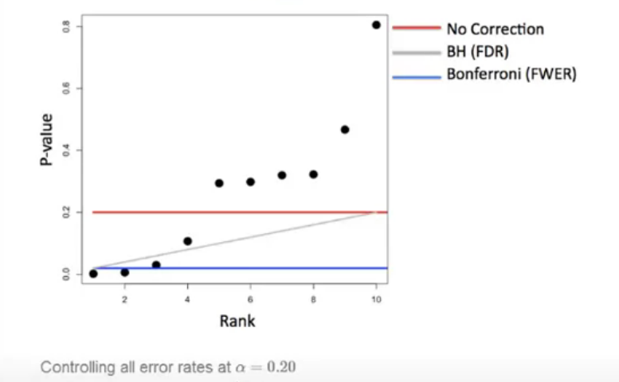

```{r setup, include=FALSE}
knitr::opts_chunk$set(echo = TRUE)
```

# Intro  
Instructor's Note:  
"*Statistical inference is the process of drawing conclusions about populations or scientific truths from data. There are many modes of performing inference including statistical modeling, data oriented strategies and explicit use of designs and randomization in analyses. Furthermore, there are broad theories (frequentists, Bayesian, likelihood, design based, …) & numerous complexities (missing data, observed and unobserved confounding, biases) for performing inference. A practitioner can often be left in a debilitating maze of techniques, philosophies and nuance. This course presents the fundamentals of inference in a practical approach for getting things done. After taking this course, students will understand the broad directions of statistical inference and use this information for making informed choices in analyzing data.*  
  
*All the best,*  
  
*Brian Caffo*"  

Statistical inference help us extend beyond a small subset of data to give answers about a population.  

Course Description:  
"*In this class students will learn the fundamentals of statistical inference. Students will receive a broad overview of the goals, assumptions and modes of performing statistical inference. Students will be able to perform inferential tasks in highly targeted settings and will be able to use the skills developed as a roadmap for more complex inferential challenges.*"  


## GitHub Link for Lectures  
**[Statistical Inference Lectures on GitHub](https://github.com/bcaffo/courses/tree/master/06_StatisticalInference)**  


## Course Book  
**[The book for this course is located on LeanPub](https://leanpub.com/LittleInferenceBook)**  


## Data Science Specialization Community Site  
**[The site is created using GitHub Pages](http://datasciencespecialization.github.io/)**  

## Homework Problems  
The homework problems are optional, they are a good opportunity to practice the skills covered in the course. There are also worked out solutions on youtube (linked to from the book)  

Here's all four homeworks as interactive web pages (it's probably better to just keep up with them from the book):  
* **[HW 1](http://bcaffo.github.io/courses/06_StatisticalInference/homework/hw1.html#1)**  
* **[HW 2](http://bcaffo.github.io/courses/06_StatisticalInference/homework/hw2.html#1)**  
* **[HW 3](http://bcaffo.github.io/courses/06_StatisticalInference/homework/hw3.html#1)**  
* **[HW 4](http://bcaffo.github.io/courses/06_StatisticalInference/homework/hw4.html#1)**  


# Probability & Expected Values  
## Introduction to Probability  
### Intro  
Probability assigns a number between 0 and 1 to events to give a sense of the "chance" of the event. These sections will look at the basics of probability calculus.  

**[An additional resource is the class Mathematical Biostatistics Boot Camp 1](https://www.youtube.com/playlist?list=PLpl-gQkQivXhk6qSyiNj51qamjAtZISJ-)**  
### Probability  
Given a random experiment (i.e. rolling a die) a probability measure is a population quantity that summarizes the randomness  

Specifically, probability takes a possible outcome from the experiment and:  
* assigns it a number between 0 and 1  
* so that the probability that something occurs is 1 (the die must be rolled)  
* so that the probability of the union of any two sets of outsomes that are mutually exclusive is the sum of their repective probabilities (`P(E|F) = P(E) + P(F)`)  

### Rules probability must follow  
* The probability that nothing occurs is 0  
* The probability that something occurs is 1  
* The probability of something is 1 minus the probability that the opposite occurs, the conjugate  
* If an event **A** implies the occurrence of event **B**, then the probability of **A** occuring is less than or equal to the probability that **B** occurs  
* For any two events the probability that at least one occurs is the sum of thier probabilites minus their intersection (`P(E|F) = P(E)+P(F)-P(E&F)`)  

## Lesson with `swirl()`: Introduction  
(No new content)


## Probability mass functions  
* Probability calculus is useful for understanding the rules that probabilities must follow.  
* We need ways to model and think about probabilites for numeric outcomes of experiments  
        + Densities and mass functions for random variables are the best starting point for this  
* The goal is to use the data to estimate properties of the population  
* A **random variable** is a numeric outsome of an experiment and can be **discrete** or **continuous**  
        + For **discrete** a probability can be assigned for every value it can take  
        + for **continous** a probability can be assigned for the ranges of values it can take  

Some examples of variables that can be seen as random variables  
* The outcome of the flip of a coin (discrete)  
* The outcome from the roll of a die (discrete)  
* The web site traffic on a given day  
        + Since this discrete variable has no upper bound we'd view it as a poisoon distribution  
* The BMI of a subject four years after a baseline measuremnt (continous)  
* The hypertension status of a subject randomly drawn from a population (binomial discrete variable)  
* The number of people who click on an ad (discrete; poisson)  
* Intelligence quotients for a sample of children (continous)  

## Lesson with `swirl()`: Probability1  
(No new content. Went over some basic probability situations, such as drawing cards from a deck)  

### PMF  
* A **Probability mass function** evaluated at a value corresponds ot the probability that a random variable takes that value. To be a valid pmf a function, $p$, must satisfy:  
        1) It must always be larger than or equal to 0  
        2) The sum of the possible values that the random variable can take has to add up to one  
  
Example: Coin Flip  
$X = 0$ represents tails and $X = 1$ represents heads  
$p(x) = (1/2)^x * (1/2)^{1-x} for x = 0,1$  
And for a loaded coin this could be generalized as  
$p(x) = \theta^x * (1-\theta)^{1-x} for x = 0,1$ where $\theta$ represents propabilty of heads  
When evaluating this we get..  
Probability of heads is $p(1) = \theta^1 * (1-\theta)^{1-1} = \theta$ and  
Probability of tails is $p(0) = \theta^0 * (1-\theta)^{1-0} = 1-\theta$   

## Probability densisty functions  
* A **probability density function** (pdf), is a function associated with a continouous random variable  
* To be a valid pdf, a function must:  
1) Be larger than or equal to zero everywhere  
2) The total area under it must be one  

* Areas under pdfs correspond to probabilities for that random variable  

### Example with beta density (triangle & piecewise fn)  
$f(x) = \left\{\begin{array}{ll} 2x & for \quad 0 < x < 1 \\ 0 & \quad otherwise \end{array} \right.$
  
```{r}
x <- c(-0.5, 0, 1, 1, 1.5)
y <- c(   0, 0, 2, 0,   0)
plot(x, y, lwd = 3, frame = FALSE, type = "l")
```

To check if this is a valid PDF we can calculate the total area, using geometry we have a triangle with a *base of 1* and a *height of 2* $A=1/2bh = h/2*b = 2/2 *1 = 1$, therefore it statisfies the rules for a PDF.  
  

$\int_0^1\mathrm{2x}\mathrm{d}x = [x^2]|_0^1 = 1^2 - 0^2 = 1$

Assume this pdf is for the porportion of health calls that get addressed in a given day. What's the probability that 75% or fewer of calls get addressed?  
$\int_0^{0.75}\mathrm{2x}\mathrm{d}x = [x^2]|_0^{0.75} = {0.75}^2 - 0^2 = 0.5625$  
The beta function is also a function in R:  
```{r}
#first param is for the quantile
#second param is the height of the distrbution
#third param is the width of the dist.
pbeta(0.75, 2, 1)
```

### Cumulative Distribution Function (CDF) and Survival Function  
The **cumulative distribution function** (CDF) of a random variable, X, returns the probability that the random varaible is less than or equal to the value of x  
$F(x) = P(X\leq x)$  
  
The **survival function** of a random variable X is defined as the probability that the random variable is greater than the value x  
$S(x) = P(X > x)$  
Notice that $S(x) = 1 - F(x)$  

We can evaluate multiple quantiles at once with `pbeta`  
```{r}
pbeta(c(0.4, 0.5, 0.6), 2, 1)
```

### Quantile  
The $\alpha^{th}$ **quantile** of a distribution with distribution function $F$ is the point $x_\alpha$ such that $F(x_\alpha) = \alpha$  
* A **percentile** is simply a quantile with $\alpha$ expressed as a percent  
* The **median** is the $50^{th}$ percentile  
* The `qbeta` function will take a quantile and return the value of $x_\alpha$  
```{r}
sqrt(.5) #Solving x^2 = 0.5 manually
qbeta(0.5, 2, 1)
```

## Lesson with `swirl()`: Probability2  
* Continous random variables are usually associated with measurements of time, disance, or some biological process that can take any value  
  + Limitations of precision in taking the measurements may imply the values are discrete, but we consider them continuous.  
* A sample median is an estimato of a population median (the estimand)  


## Conditional Probability  
* Conditional Probability is a probability of an event (E) given some condition (F) represented as $P(E|F)$ (Probability of E given F)  
* The probability of a die landing on 1 is 1/6, however the probability of a die landing on a 1 *given* the die landed on an odd number is 1/3  
* The general formula for conditional probability is $P(A|B) = \frac{P(A \bigcap B)}{P(B)}$  


## Bayes' rule  
* Named after **[Thomas Bayes](http://en.wikipedia.org/wiki/Thomas_Bayes)**  
* Used to find $P(B|A)$ when one knows $P(A|B)$, however one also has to know $P(B)$ and $P(B^c)$  
$P(B|A) = \frac{P(A|B)P(B)}{P(A|B)P(B) + P(A|B^c)P(B^c)}$  

### Diagnostic Tests  
Bayes' rule is useful in diagnostic tests  
* Let $+$ and $-$ be the events that the result of a diagnostic test is positive or negative repectively  
* Let $D$ and $D^c$ be the event that the subject of the test has or does not have the disease repectively  
* Then the **sensitivity** of the test can be evaluated as $P(+|D)$, the probability the test is positive given the subject has the disease  
* Likewise, the **specificity** of the test is evaluated as $P(-|D^c)$, the probability the test is negative given the subject does not have the disease  
        + A good test has high specificity  
* **Positive predictive value** - probability of having a disease given a positive test, $P(D|+)$  
* **Negative predictive value** - probability of not having the disease given a negative test, $P(D^c|-)$  
* **Prevalence of the disease** - just the probability of having the disease, $P(D)$  

Example:  
Say there is a test for HIV such that it has...  
* a sensitivity of 99.7%; $P(+|D) = 0.997$  
* a specificity of 98.5%; $P(-|D^c) = 0.985$  
* population has a prevalence of HIV of 0.1%; $P(D) = 0.001$  
What is the associated positive predictive value, $P(D|+)$?  
$P(D|+) = \frac{P(+|D)P(D)}{P(+|D)P(D) + P(+|D^c)P(D^c)}$  
$P(D|+) = \frac{0.997*0.001}{0.997*0.001+(1-P(-|D^c))*(1-P(D))}$  
0.997 * 0.001 = $`r 0.997*0.001`$  
$P(D|+) = \frac{0.000997}{0.000997 + (1-0.985)*(1-0.001)}$  
1-0.985 = $`r 1-0.985`$  
1-0.001 = $`r 1-0.001`$  
0.015 * 0.999 = $`r 0.015*0.999`$  
$P(D|+) = \frac{0.000997}{0.000997 + 0.014985}$  
$P(D|+) = \frac{0.000997}{0.000997 + 0.014985}$  
$P(D|+) = \frac{0.000997}{0.015982}$  
$P(D|+) = 0.06238...$  
So the positive predictive value is about 6.2%  
  
The low prevalence in the population is the reason for the low positive predictive value. 
  
We can also look at the probability of not having the disease given a positive test,  
$P(D^c|+) = \frac{P(+|D^c)P(D^c)}{P(+|D^c)P(D^c) + P(+|D)P(D)}$  
It can be seen that the denominator is equivalent to the denominator is $P(D|+)$ through the communitative property  
$P(D^c|+) = \frac{P(+|D^c)P(D^c)}{P(+|D)P(D)+P(+|D^c)P(D^c)}$
as such we can evaluate this as so:  
$P(D^c|+) = \frac{(1-P(-|D^c))(1-P(D))}{0.015982}$  
$P(D^c|+) = \frac{(1-0.985)(1-0.001)}{0.015982}$  
1-0.985 = $`r 1-0.985`$ ; 1-0.001 = $`r 1-0.001`$
0.015 * 0.999 = $`r 0.015*0.999`$  
$P(D^c|+) = \frac{0.014985}{0.015982}$  
$P(D^c|+) = 0.9376...$  
  
### Likelihood Ratio  
But we are more interested in the **likelihood ratio**, that is given a positive test how does this increase your "*odds*" of having the disease.
* **odds** are the ratio of $\frac{P(E)}{P(E^c)}$  
  
In the case of the example we'd want to find the Diagnostic likelihood ratio for a positive test result; how does getting a positive result affect your odds. This would be expressed as such:  
$\frac{P(D|+)}{P(D^c|+)}$  
Since the denominators of these two are equivalent this would simplify to:  
$\frac{P(+|D)}{P(+|D^c)} * \frac{P(D)}{P(D^c)}$  
The first expression is your Diagnostic Likelihood Ratio, the value your pre-test odds, $\frac{P(D)}{P(D^c)}$ ,are multiplied by for recieving a positive test result.  

$DLR_+ = \frac{0.997}{(1-0.985)} \approx 66$  
Meaning that the odds of you having the disease after a positive test result is 66 times more than before the test.

## Lesson with `swirl()`: Conditional Probability  
* $P(B|A) = \frac{P(B\cap A)}{P(A)} = P(A|B) * \frac{P(B)}{P(A)}$  
  + This is a simple form of Bayes' rule  
* Suppose we don't know $P(A)$, but only know its conditional probabilities, $P(A|B)$ and $P(A|B^c)$  
  + We could deduce $P(A) = P(A|B) * P(B) + P(A|B^c) * P(B^c)$ since this would essentially be the sum of $P(A\cap B) + P(A\cap B^c)$ which with discrete mathematics would be reduced to just $P(A)$ since it's the intersection of A with all of B and all of *not* B, resulting in only A.
  + This is why $P(A|B) * P(B) + P(A|B^c) * P(B^c)$ is the denominator in Bayes' rule  
  


## Independence  
Event A is independent of event B if $P(A|B) = P(A)$ where $P(B) > 0$  
As well as if $P(A \cap B) = P(A)P(B)$  
As such $P(A_1 \cap A_2)$ if & only if $A_1$ and $A_2$ are independent events  
* **Independent Identically Distributed (iid)** - random variables that are independent and identically distribtued  
        + Independent - statistically unrelated from one and another  
        + Identically distributed - all having been drawn from the same population distribution  
* iid random variables are the default model for random samples  


## Expected values  
* Another term for the pop. mean of a random variable  
* The sample mean can be thought of as the center of mass of data if each data point is equally likely  
* However, since not all points are equally likely the mean is found by getting the expected value of each discrete variable  
```{r}
PMtable <- data.frame(value = c(0:4), prob = c(0.1,0.15,0.4,0.25,0.1))
PMtable
#We can see this is a valid dist. since the probabilites sum to 1
sum(PMtable$prob)
#To get the mean we can get the expected value of each variable...
EVs <- PMtable$value * PMtable$prob
PMtable <- cbind(PMtable, EVs)
PMtable
#Then take the sum of the Expected values
sum(PMtable$EVs)

#This is the same as if we had a sample population with a rel. freq
#that is the same as the probabilities
rFreq <- PMtable$prob*100
sample <- c(rep(0, rFreq[1]), 
            rep(1, rFreq[2]), 
            rep(2, rFreq[3]), 
            rep(3, rFreq[4]), 
            rep(4, rFreq[5]))
mean(sample)
```

The population mean, denoted $E[X]$, represents the center of mass for a collection of locations, $x$, and weights, $p(x)$  
$E[X] = \sum_{x} xp(x)$  
  

## Expected values, simple examples  
* The expected value can be a value that the discrete variables can't take, but represents the center of mass of the areas of each results' probabilities  
* In an example for a die the expected value would be:  
```{r}
die <- data.frame(value = 1:6, prob = rep(1/6,6))
sum(die$value*die$prob)
```
  
  
## Expected values for PDFs  
* Similar to the PMF the pop. mean of the PDF is akin to the center of mass of it's density function  
* The sample mean will be centered on the same as the original, population mean.  
        + When this occurs, the sample mean is said to be **unbiased** because its distribution is centered at what it's trying to estimate  
        
* I made **[a good graph on desmos](https://www.desmos.com/calculator/cwfppuhrqz)** that helps visualize this back when I was tutoring. As the sample size increases the probability of the sample mean equaling the population mean tends towards 100%  

### Summary  
* Expected values are properties of distibutions  
* The population mean is the center of mass of population  
* The sample mean is the center of mass of the observed data  
* The sample mean is an estimate of the population mean  
* The sample mean is unbiased  
        + The population mean of its distribution is the mean that it's trying to estimate  
* The more data that goes into the sample mean, the more concentrated its density / mass function is around the population mean  

## Lesson with `swirl()`: Expectations  
(No new content)

## Quiz 1  
1. Consider influenza epidemics for two parent heterosexual families. Suppose that the probability is 17% that at least one of the parents has contracted the disease. The probability that the father has contracted influenza is 12% while the probability that both the mother and father have contracted the disease is 6%. What is the probability that the mother has contracted influenza?  
```{r}
#P(M or F) = P(M) + P(F) - P(M&F)
#0.17 = P(M) + 0.12 - 0.06
#P(M) = 0.17 - 0.12 + 0.06
0.17 - 0.12 + 0.06
```

2. A random variable, X is uniform, a box from 0 to 1 of height 1. (So that its density is f(x) = 1 for 0 <= x <= 1. What is its 75th percentile? 
* It's a uniform density so it's just at 0.75  

3. You are playing a game with a friend where you flip a coin and if it comes up heads you give her X dollars and if it comes up tails she gives you Y dollars. The probability that the coin is heads is p (some number between 0 and 1.) What has to be true about X and Y to make so that both of your expected total earnings is 0. The game would then be called “fair”.  
* -X * p + (1-p) * Y = 0

4. A density that looks like a normal density (but may or may not be exactly normal) is exactly symmetric about zero. (Symmetric means if you flip it around zero it looks the same.) What is its median?  
* if the data is symetric about 0 the median must be 0  

5. What is the mean of the following PMF  
```{r}
data <- data.frame(X = 1:4, Prob = (1:4)*0.1)
sum(data$X*data$Prob)
```

6. A web site (www.medicine.ox.ac.uk/bandolier/band64/b64-7.html) for home pregnancy tests cites the following: “When the subjects using the test were women who collected and tested their own samples, the overall sensitivity was 75%. Specificity was also low, in the range 52% to 75%.” Assume the lower value for the specificity. Suppose a subject has a positive test and that 30% of women taking pregnancy tests are actually pregnant. What is the probability of pregnancy given the positive test?  

```{r}
sens <- 0.75; spec <- 0.52; preg <- 0.3
pregGivenPos <- (sens * preg) / 
                  ((sens * preg) + (1 - spec) * (1 - preg))
pregGivenPos
```


# Variability, Distribution, & Asymptotics  
## Introduction to Variability  
* Variability is a measuremnt of a sample's variability  
* Often we consider the square root of population variability and sample variance, called the standard deviation  
  + This is done beecuase the std. dev. has the same units as the population (i.e. if the population is a length in meters, the standard deviation is also in meters (whereas the variance is in meters$^2$))  
* The variance is the sum of the differences of each data point to the mean, squared. 
  + $Var(X) = E [(X-\mu)^2] = E[X^2]-E[X]^2$  
  
Die Example:
```{r echo = FALSE}
options(scipen = 999)
```


$E[X] = 3.5$  

$E[X^{2}]=1^{2}*\frac{1}{6}+2^{2}*\frac{1}{6}+3^{2}$ ... 

... $*\frac{1}{6}+4^{2}*\frac{1}{6}+5^{2}*\frac{1}{6}$ ...

... $+ 6^{2}*\frac{1}{6}=$ ...  

```{r}
expectedXsquared <- round((1^2+2^2+3^2+4^2+5^2+6^2)*1/6, 2)
expectedX <- sum(1:6*1/6)
```
= $`r expectedXsquared`$

Var(X) = expectedXsquared - expectedX$^2$ = $`r expectedXsquared - expectedX^2`$

* As the variance increases in a normal distribution the curve will flatten as the values are spread more about the mean  

* The **sample variance** is the sum of the variation from the mean squared of each data point, then divided by $n-1$  
  + $S^2 = \frac{\Sigma_{i-1}(X_i-\bar{X})}{n-1}$  
  + When taking a sample and measuring the variance we are estimating the population's variance. Since the sample is likely to miss outliers in the population, dividing by $n-1$ increases the value of the variaence, and gets a better estimate of the true population variance. If a sample of a population is taken where the population mean is known, the variancce calculated with the sample mean will always be smaller than the variance calculated with the population mean; since the sample mean will always be generally closer to the sample. Dividing by $n-1$ couteracts this downward bias.
  


## Variance Simulation Examples
```{r warning=FALSE}
set.seed(1618033)
library(tidyverse)
ten <- replicate(1618, sd(sample(1:6, 10, TRUE)))
twenty <- replicate(1618, sd(sample(1:6, 20, TRUE)))
thirty <- replicate(1618, sd(sample(1:6, 30, TRUE)))
data <- rbind(cbind(ten, rep("10", length(ten))),
              cbind(twenty, rep("20", length(twenty))),
              cbind(thirty, rep("30", length(thirty))))
data <- as.tbl(data.frame(data))
data <- rename(data, Standard.Deviation = ten, n = V2) %>%
            mutate(n = as.factor(n), 
                   Standard.Deviation =
                     as.numeric(as.character(Standard.Deviation)))
plot <- ggplot(data, aes(Standard.Deviation)) + 
  geom_histogram(binwidth = 0.15)  +
  facet_wrap(n~.) +
  geom_vline(xintercept = sqrt(2.92), col = "#FF0000")
plot

```

The above code shows the distribution of the standard deviation (sqrt(variance)) for a sample of dice rolls, sample size is 10, 20, and 30. It can be seen that with all samples the mean of the standard deviations tends towards the true population mean that we are estimating with each sample. The sd's get more concentrated around the true pop. sd as the samples are comprised of more dice per sample.

## Standard Error of the Mean  
* The variance of the sample mean is the population variance divided by the sample size  
  + $\sigma^2/n$  
* As such the standard deviation of the sample mean, **the standard error**, is the population standard deviation divided by the square root of the sample size  
  + $\sigma/\sqrt{n}$  
* The mean of the sample mean is equivelant to the population mean  
  
### Simulations  
```{r}
set.seed(1618033)
numSims <- 10000
n <- 10
sd(apply(matrix(#v# 1 param indicates the pop sd
  rnorm(numSims * n), numSims), 1, mean))
1/sqrt(n)
```
```{r}
sd(apply(matrix(# runif is a uniform distribution
  runif(numSims * n), numSims), 1, mean))
#standard uniform distributions have a variance of 1/12
#sqrt(1/12)/sqrt(n) = 1/sqrt(12*n)
1/sqrt(12 * n)
```
```{r}
#Poisson(4) have a variance of 4; so a random sample of 
#n Poisson(4) have a sd of 2/sqrt(n)
sd(apply(matrix(rpois(numSims * n, 4), numSims), 1, mean))
2/sqrt(n)
```
```{r}
#Fair coin flips have variance of 0.25, so a random sample of
#n coin flips have sd of 1/sqrt(4*n) or 1/(2*sqrt(n))
sd(apply(matrix(sample(0:1, numSims * n, replace = TRUE), 
                numSims), 1, mean))
1/(2*sqrt(n))
```


## Variance Data Example  
```{r message = FALSE}
library(UsingR)
```
```{r}
data(father.son)
x <- father.son$sheight
n <- length(x)

plot <- ggplot(father.son, aes(sheight)) +
  geom_histogram(aes(y = ..density..), binwidth = 1, 
                 fill = "#FF0000",colour = "#000000")
plot + geom_density(size = 2, colour = "#000000")
```
  
* The variability of this histogram estimates the variability of son's heights in the population  
```{r}
data.frame(Sample.Variance = var(x), Sample.SD = sd(x),
           Variability.Of.Avg = var(x)/n, SD.Of.Avg = sd(x)/sqrt(n))
```

* Both `X.Of.Avg` is an estimate, but it's still the best estimate we can get given the sample data  

### Summarizing What We Know About Variances  
* The sample variance estimates the population variance  
* The distribution fo the sample variance is centered at what its estimating  
  + It gets more concentrated around the population variance with larger sample sizes  
* The variance of the sample mean is the population variance divided by $n$  
  + $Var(\bar{X}) = \sigma^2/n$  


## Lesson with `swirl()`: Variance  

* **Chebyshev's inequality** - Probability that a random variable X is *at least* k standard deviations from it's mean  
  + $P(X < (\mu+k*\sigma)) < \frac{1}{k^2}$  


## Binomial Distrubtion  
* Formally called **The Bernoulli Distribution**, named after **[Jacob Bernoulli](https://en.wikipedia.org/wiki/Jacob_Bernoulli)** (whom sided with Leibniz).  
* The distribution arrises from a coin flip, that may be biased  
* Bernoulli random variables take (only) the values 1 and 0 with probabilities of $p$ and $1-p$ repectively  
The probability mass function:    

$P(X =x) = p^x(1-p)^{1-x}$  
  
* The mean is $p$ and the variance is $p(1-p)$  
* A 1 is considered a "success" regardless if the case of a 1 is successful or not.  
  
### Binomial Trials  
A binomial random variable is the sum of successes in a trial  
* In specific, let $X_1,..., X_n$ be independent and identically distributed (iid) random variables of a Bernoulli distribution  
then $X = \Sigma_{i=1}^n X_i$ is a binomial random variable  
The PMF:    

$P(X = x) = \binom{n}{x} p^x (1-p)^{n-x}$  
  
Note on notation:  
$\binom{n}{x}$  
(read as "n choose x") counts the number of ways of selecting $x$ items out of $n$ without replacement disregarding the order of the items  
$\binom{n}{x} = \frac{n!}{x!(n-x)!}$  
$\binom{n}{0} = \frac{n!}{0!(n-0)!} = \frac{n!}{1*n!} = 1$  
likewise:  
$\binom{n}{n} = \frac{n!}{n!(n-n)!} = \frac{n!}{n!*1} = 1$  
since $0! = 1$  
  
### Example  
Suppose a friend has 8 children, 7 of which are girls. If each gender has an independent 50% probability for each birth, what's the probability of getting 7 or more girls out of 8 births?  
$\binom{8}{7}0.5^7(1-0.5)^1+\binom{8}{8}0.5^8(1-0.5)^0$  

$\frac{8!}{7!(8-7)!}*0.5^7*0.5+1*0.5^8*1$

$\frac{8!}{7!*1}*0.5^8+0.5^8=8*0.5^8+0.5^8$  

$(8+1)*0.5^8=\frac{9}{2^8}\approx0.035$  
  
In R:  
```{r}
#Explicitly doing the formula:
choose(8, 7) * 0.5^8 + choose(8, 8) * 0.5^8
#Using binom function:
pbinom(6, size = 8, prob = 0.5, lower.tail = FALSE)
```


## Normal Distribution  
* Also called a **Gaussian distribution** with a mean $\mu$ and variance $\sigma^2$  
  + Sometimes expressed as: $X\sim N(\mu, \sigma^2)$
* It's density is the bell curve, represented by the formula:  
$(2\pi\sigma^2)^{-1/2}e^{-(x-\mu)^2/2\sigma^2}$  


### Standard Normal Distribution  
Normal Distribution when $\mu = 0$ and $\sigma = 1$  
Standard normal random variables are often labeled $z$, which will come up when looking at *z-scores*  
* There are a number of properties that are found using the standard normal distributions, since the values 1, 2, and 3 respectively represent $1\sigma$, $2\sigma$, and $3\sigma$.  
  + Any Normal distribution can have these properties too just being centered at the mean (i.e. $\mu + 1\sigma$, $\mu + 2\sigma$ ...)  
  
### Emperical Rule  
* The area within z * $\sigma$ from the mean represents _% of the mean:
  + 1 : 68%  
  + 2 : 95% (Really 1.96, but often rounded up)  
  + 3 : 99.7%  

### Z scores  
* A z-score represents how many $\sigma$ a given point is from the mean  
* Converting  
  + If $X \sim N(\mu, \sigma^2)$ then $Z = \frac{X - \mu}{\sigma} ~ N(0,1)$  
  + If $Z$ is standard normal then $X = \mu + Z\sigma ~ N(\mu,\sigma^2)$  
Notable percentiles:  
* **X** is the $XX^{th}$ percentile  
  + Negatives  
    **-2.33** : $1^{st}$  
    **-1.96** : $2.5^{th}$  
    **-1.645** : $5^{th}$  
    **-1.28** : $10^{th}$  
  + Positives  
    **1.28** : $90^{th}$  
    **1.645** : $95^{th}$  
    **1.96** : $97.5^{th}$ 
    **2.33** : $99^{th}$  
* Remembering one set will essentially allow you to reference the other set since SND is symetric  
  + Some off-hand mnumonics I came up with  
    - 1.28 relates to 10% since 2+8 = 10  
    - 1.64**5** relates to **5**%, aside from that I have the golden ratio memorized and 5% is like the statistical "golden standard",so this starts simular, **1.6**18, then half of *8* is **4** giving the **1.645** (Not the best but meh)  
    - 97.5% is like a step up from 95%, so it's number is 1.**96**  
    - 99th percentile has to be less than *3* standard deviations, so it must start with **2**, then 99/*3* = **33** giving the **2.33**
    
### Using R  
What is the $95^{th}$ percentile of a $N(\mu,\sigma^2)$ distribution?  
```{r}
#v- Rough estimate of IQ data 
mu <- 100
std <- 18
#Using known info from above, the 95th percentile should be 
#1.645sd from the mean
mu+1.645*std

qnorm(0.95, mean = mu, sd = std)

#Probability that an IQ is larger than 140?
pnorm(140, mu, std, lower.tail = FALSE)
#or
1 - pnorm(140, mu, std)
```
So it can be seen the 1.645 estimate is pretty close to the truth  


## Poisson  
* Used to model counts over a time duration  
PMF:  
$P(X = x; \lambda) = \frac{\lambda^xe^{-\lambda}}{x!}$  
  
The mean **and** variance of this distribution is $\lambda$  
Poisson random variables are used to model rates  
* $X\sim Poisson(\lambda t)$ where  
  + $\lambda = E[X/t]$ is the expected count per unit of time  
  + $t$ is the total monitoring time  


### When we use Poisson  
* Modeling count data (especially if there is no upper bound)  
* Modeling event-time or survival data  
  + Example: Modeling reoccurance of a system during the duration of a study  
* Modeling contingency tables  
  + Ex: Hair color by race  
* Approximating binomials when $n$ is large and $p$ is small  
  + Common in epidemiology  

### Example  
The number of people that show up at a bus stop is Poisson witha  mean of 2.5 per hour.  
If watching the bus stop for 4 hours, what is the probability that 3 or fewer people show up for the whole time?  
```{r}
#Using the formula
l <- 2.5*4
((l^3)*exp(1)^(-l))/factorial(3) +
  ((l^2)*exp(1)^(-l))/factorial(2) +
  ((l^1)*exp(1)^(-l))/factorial(1) +
  ((l^0)*exp(1)^(-l))/factorial(0)

#Using the function
ppois(3, lambda = 2.5*4)
```

### Poisson Approximation to the Binomial  
* When $n$ is large and $p$ is small the Poisson distribution is an accurate approximation to the binomial distribution  
* Notation  
  + $X \sim Binomial(n,p)$  
  + $\lambda = np$  
  + $n$ gets large  
  + $p$ gets small  
  
Example:  
We flip a coin with success probability 0.01 five hundred times.  
What's the probability of 2 or fewer successes?  

```{r}
pbinom(2, size = 500, prob = 0.01)
ppois(2, lambda = 500*0.01)
err <- abs(pbinom(2, size = 500, prob = 0.01) - 
             ppois(2, lambda = 500*0.01))
paste0("This has an absolute error of approximately ", round(err, 6))
```


## Lesson with `swirl()`: CommonDistros  
(No new content)


## Asymptotics and the Law of Large Numbers (LLN)  
* Asymptotics refers to the behavior of estimators as the sample size goes to infinity. 
  + In statistics we'll be concerned with as the sample size tends to infinity  
* Asymptotics are useful for simple statistical inference and approximations  
* Asymptotics form the baiss for frequency interpretation of probabilities  
  + If you flip a coin, the proportion of heads should approach .5 as your sample size approaches infinity  
    - **[Count Buffon](https://en.wikipedia.org/wiki/Georges-Louis_Leclerc%2C_Comte_de_Buffon)** tossed a coin 4040 times. Result: 2048 heads, a proportion of 0.5069 for heads  
    - **[Karl Pearson](https://en.wikipedia.org/wiki/Karl_Pearson)** *heroically* tossed a coin 24000 times. Result: 12012 heads, a proportion of 0.5005  
    - **[John Kerrich](https://en.wikipedia.org/wiki/John_Edmund_Kerrich)**, while imprisoned by Germans durring WW2 tossed a coin 10000 times. Result: 5067 heads, a proportion of 0.5067

### Law of Large Numbers  
* The average limits to what its estiamting, the population  
* Example $\bar{X}_n$ could be the average of the result of $n$ coin flips  
* As we flip a fair coin over and over, it eventually converges to the true probability of a head  

### Examples  
```{r}
#SND
set.seed(161803)
n <- 1000
means <- cumsum(rnorm(n))/(1:n)
plot <- ggplot(data.frame(x = 1 : n, y = means), aes(x,y)) +
  geom_line(size = 2, col = "#FF0000") + geom_hline(yintercept = 0)
plot + labs(x = "Number of obs.", y = "Cumulative mean")
```

* It can be seen here that with smaller observations the cum. mean varries greatly, but as the observations increase the mean starts to trend near 0, the expected value of a SND.  

```{r}
#Flipping a coin
set.seed(16)
n <- 1000
means <- cumsum(sample(0:1, n, replace = TRUE))/(1:n)
plot <- ggplot(data.frame(x = 1 : n, y = means), aes(x,y)) +
  geom_line(size = 2, col = "#FF0000") + geom_hline(yintercept = 0.5)
plot + labs(x = "Number of obs.", y = "Cumulative mean")
```

* Again here, we can see large variablity in small observations then it approaches the assymptote of 0.5 as the observations increase

### Summary  
* An estimator is **consistent** if it converges to what you want to estimate  
* The LLN says that the sample mean of iid samples is consistent for the population mean  
* Typically, good estimators are consistent; if we collect an infinite amount of data we would get the right answer  


## Asymptotics and the Central Limit Theorem (CLT)  
* CLT states that the distribution of averages is often normal, even if the distribution that the data is being sampled from is very non-normal  
  + This helps us create stategies for creating statistical inferences when we're not willing to assume much about the generating mechanism of our data.  

CLT as a formula:  
$\frac{\bar{X}_n-\mu}{\sigma/\sqrt{n}}=\frac{\sqrt{n}(\bar{X}_n-\mu)}{\sigma}$  

$\frac{Estimate - Mean~of~estimate}{Std.~Err.~of~estimate}$  

... will have a distribution like that of a standard normal for large $n$.  
* A way to think about the CLT is that $\bar{X}_n$ is approximately $N(\mu,\sigma^2/n)$  

### Example  
```{r}
##Flipping an unfair coin
set.seed(1618)
nosim <- 1000
pHeads <- 0.9
cfunc <- function(x, n) {sqrt(n)*(mean(x)-pHeads)}/ sqrt(pHeads*(1-pHeads))
data <- data.frame(
  x = c(apply(matrix(sample(0:1, prob = c(1 - pHeads, pHeads), nosim * 10,
                            replace = TRUE), nosim), 1, cfunc, 10),
        apply(matrix(sample(0:1, prob = c(1 - pHeads, pHeads), nosim * 20,
                            replace = TRUE), nosim), 1, cfunc, 20),
        apply(matrix(sample(0:1, prob = c(1 - pHeads, pHeads), nosim * 30,
                            replace = TRUE), nosim), 1, cfunc, 30)
        ),
  size = factor(rep(c(10, 20, 30), rep(nosim, 3))))

plot <- ggplot(data, aes(x, fill = size)) +
  geom_histogram(binwidth = 0.3, colour = "#000000", aes(y = ..density..)) +
  facet_grid(. ~ size)
plot + stat_function(fun = dnorm, size = 2)
```
* In the smaller groups some of the discrete-ness of data can be seen, nevertheless as the samples grow in size it can be seen that the distributions more closely match the underlying normal distribution  

* The **[Galton Board](https://en.wikipedia.org/wiki/Bean_machine)** simulates the central limit theorem with a binomial distribution.  


## Asymptotics and Confidence Intervals  
* The probability $\bar{X}$ is bigger than $\mu+2\sigma/\sqrt{n}$ or maller than $\mu-2\sigma/\sqrt{n}$ is 5%; in other words, the probability $\bar{X}$ is within that range is 95%  
* As such, a 95% interval for $\mu$ is $\bar{X}\pm2\sigma/\sqrt{n}$  
  + If we were to repeatitly collect a sample in about 95% of the cases this interval would contain $\mu$  
  
### Example  
```{r message = FALSE}
library(UsingR)
data(father.son)
```
```{r}
x <- father.son$sheight  
#Mean \pm the 97.5% quantile*sd/\sqrt{n}
interval <- (mean(x) + c(-1,1)*qnorm(0.975)*sd(x)/sqrt(length(x)))
#Convert result to feet
feetint <- round(interval*1/12, 3)
feetint
```
* we could say that we are 95% confident that the population mean height of sons from the population the data is drawn from is between `r feetint[1]` and `r feetint[2]` feet.  

In a random sample of 100 likely voters, 56 intent to vote for your canidate  
  + Can you relax? Do you have this race "in the bag"?  
```{r}
#Executing formula
0.56 + c(-1,1) * qnorm(0.975) * sqrt(0.56 * 0.44/100)

#Using R function
binom.test(56, 100)$conf.int
```
* Since the interval goes below 0.50 you can't relax and ought to do more campaigning  
* `binom.test` is exact, as it does some additional computations that aren't normally done by hand. Also tends to have wider intervals  

Simulation to check confidence intervals  
```{r}
set.seed(1618)
n <- 20 #Flips per simulation
pvals <- seq(0.1, 0.9, by = 0.05) #'p's we'll check with
nosim <- 1000
coverage <- sapply(pvals, function(p){
  phats <- rbinom(nosim, prob = p, size = n)/n #point estimates
  ll <- phats - qnorm(0.975) * sqrt(phats * (1 - phats)/n)
  ul <- phats + qnorm(0.975) * sqrt(phats * (1 - phats)/n)
  mean(ll < p & ul > p) #Check proportion of times the true p is in the range
})
ggplot(data.frame(pvals, coverage), aes(pvals, coverage)) +
  geom_line(size = 2, color = "#FF0000") +
  geom_hline(yintercept = 0.95) +
  ylim(0.75, 1)
```
* Since `n` is small the coverage is often giving lower than 95% confidence  

```{r}
#Larger n value
set.seed(1618033)
n <- 100 #Flips per simulation
pvals <- seq(0.1, 0.9, by = 0.05) #'p's we'll check with
nosim <- 1000
coverage <- sapply(pvals, function(p){
  phats <- rbinom(nosim, prob = p, size = n)/n #point estimates
  ll <- phats - qnorm(0.975) * sqrt(phats * (1 - phats)/n)
  ul <- phats + qnorm(0.975) * sqrt(phats * (1 - phats)/n)
  mean(ll < p & ul > p) #Check proportion of times the true p is in the range
})
ggplot(data.frame(pvals, coverage), aes(pvals, coverage)) +
  geom_line(size = 2, color = "#FF0000") +
  geom_hline(yintercept = 0.95) +
  ylim(0.75, 1)
```

### Agresti/Coull interval  
* A quick fix for when $n$ isn't large enough for the CLT to be applicable for many of the values of $p$  
* Add two successes and failures
$\frac{X+2}{n+4}$  
* An advantage of this procedure is that it does not strongly depend upon the value of n and/or p, and was recommended by Agresti and Coull for virtually all combinaitons of n and p  
* **[Further Reading](https://www.itl.nist.gov/div898/software/dataplot/refman2/auxillar/agcoulci.htm)**

Looking at the $n = 20$ example again  
```{r}
set.seed(1618)
n <- 20 #Flips per simulation
pvals <- seq(0.1, 0.9, by = 0.05) #'p's we'll check with
nosim <- 1000
coverage <- sapply(pvals, function(p){
  phats <- (rbinom(nosim, prob = p, size = n) + 2)/(n + 4) #point estimates
  ll <- phats - qnorm(0.975) * sqrt(phats * (1 - phats)/n)
  ul <- phats + qnorm(0.975) * sqrt(phats * (1 - phats)/n)
  mean(ll < p & ul > p) #Check proportion of times the true p is in the range
})
ggplot(data.frame(pvals, coverage), aes(pvals, coverage)) +
  geom_line(size = 2, color = "#FF0000") +
  geom_hline(yintercept = 0.95) +
  ylim(0.75, 1)
```
* In this simulation, after applying the Agresti/Coull interval, there are no pvals that result in the CI dipping below 95%  

### Poisson interval  
A nuclear pump failed 5 times out of 94.32 days, give a 95% confidence interval for the failure rate per day  
* $X\sim Poisson(\lambda t)$  
* Estimate $\hat{\lambda} = X/t$  
* $Var(\hat{\lambda}) = \lambda / t$  
* $\hat{\lambda} / t$ is our variance estimate  
```{r}
x <- 5
t <- 94.32
lambda <- x/t

#Using the formula
round(lambda + c(-1, 1) * qnorm(0.975) * sqrt(lambda/t), 5)

#Using R function
round(poisson.test(x, T = 94.32)$conf, 5)
```
* The function gives a more conservative estimate as it's more exact from doing some additional computations to guarentee the coverage  

Simulating the Poisson Coverage Rate  
```{r}
set.seed(1618)
lambdavals <- seq(0.005, 0.1, by = 0.01)
nosim <- 1000
t <- 100
coverage <- sapply(lambdavals, function(lambda) {
  lhats <- rpois(nosim, lambda = lambda*t)/t
  ll <- lhats - qnorm(0.975) * sqrt(lhats/t)
  ul <- lhats + qnorm(0.975) * sqrt(lhats/t)
  mean(ll < lambda & ul > lambda)
})
ggplot(data.frame(lambdavals, coverage), aes(lambdavals, coverage)) +
  geom_line(size = 2, colour = "#FF0000") +
  geom_hline(yintercept = 0.95) +
  ylim(0, 1)
```
* It can be seen above that the coverage is really bad for smaller values of lambda  
  
When $t$ is larger the coverage is better, but still really bad for smalelr values of lambda  
```{r}
set.seed(1618)
lambdavals <- seq(0.005, 0.1, by = 0.01)
nosim <- 1000
t <- 1000
coverage <- sapply(lambdavals, function(lambda) {
  lhats <- rpois(nosim, lambda = lambda*t)/t
  ll <- lhats - qnorm(0.975) * sqrt(lhats/t)
  ul <- lhats + qnorm(0.975) * sqrt(lhats/t)
  mean(ll < lambda & ul > lambda)
})
ggplot(data.frame(lambdavals, coverage), aes(lambdavals, coverage)) +
  geom_line(size = 2, colour = "#FF0000") +
  geom_hline(yintercept = 0.95) +
  ylim(0, 1)
```

### Summary  
* The LLN states that averages of iid samples converge tot eh popualiton means that they are estimating  
* The CLT states that averages are approximately normal, with
  + distributions centered at the population mean  
  + standard deviation equal to the standard error of the mean  
* CLT gives no guarantee that $n$ is large enough  
* Taking the mean and $\pm$ the relevant normal quantile times the standard error yields a confidence interval for the mean  
  + $\pm$ 2 standard errors works for 95% intervals  
* Confidence intervals get wider as the coverage increases
  + Being more confident that the mean is included means more values are included in the interval  
* The Poisson and binomial cases have exact intervals that don't require the CLT  
  + But a quick fix for small sample size binomial calculations si to add 2 successes and failures  


## Lesson with `swirl()`: Asymptotics  
(No new content)

## Quiz 2  

2. Suppose that diastolic blood pressures (DBPs) for men aged 35-44 are normally distributed with a mean of 80 (mm Hg) and a standard deviation of 10. About what is the probability that a random 35-44 year old has a DBP less than 70?  
```{r}
pnorm(70, 80, 10)
```

3. Brain volume for adult women is normally distributed with a mean of about 1,100 cc for women with a standard deviation of 75 cc. What brain volume represents the 95th percentile?  
```{r}
qnorm(.95, 1100, 75)
```

4. Refer to the previous question. Brain volume for adult women is about 1,100 cc for women with a standard deviation of 75 cc. Consider the sample mean of 100 random adult women from this population. What is the 95th percentile of the distribution of that sample mean?   
```{r}
qnorm(.95, 1100, 75/sqrt(100))
```

5. You flip a fair coin 5 times, about what's the probability of getting 4 or 5 heads?  
```{r}
pbinom(3, 5, 0.5, lower.tail = FALSE)
```

6. The respiratory disturbance index (RDI), a measure of sleep disturbance, for a specific population has a mean of 15 (sleep events per hour) and a standard deviation of 10. They are not normally distributed. Give your best estimate of the probability that a sample mean RDI of 100 people is between 14 and 16 events per hour?  
```{r}
pnorm(16, 15, 10/sqrt(100)) - pnorm(14, 15, 10/sqrt(100))
```

7. Consider a standard uniform density. The mean for this density is .5 and the variance is 1 / 12. You sample 1,000 observations from this distribution and take the sample mean, what value would you expect it to be near?  
```{r}
qnorm(.5, .5, (1/12)/sqrt(1000))
```

8. The number of people showing up at a bus stop is assumed to be Poisson with a mean of 5 5 5 people per hour. You watch the bus stop for 3 hours. About what's the probability of viewing 10 or fewer people?  
```{r}
ppois(10, 5*3)
```
 

# Intervals, Testing, & P-values  
## T Confidence Intervals  
* When we estimate something using statistics, usually that estimate comes with uncertainty. Confidence intervals are a convenient way to communicate that uncertainity in estimates  
* T confidence intervals use a $t$ value rather than a $z$ interval  
  + $t$ intervals are better for small sample sizes, however are also sufficient for larger samples; as such its always preferred  
 
### t tests 
* were developed by William Gosset <3 (Under the pseudonym "Student", since Guiness wouldn't allow an employee to publish under their actual name)  
* has thicker tails than the normal  
* is indexed by a degrees of freedom; gets more like a standard normal as degrees of freedom gets larger  

* It assumes that the underlying data are iid normally distributed witht he result that  
$\frac{\bar{X}-\mu}{S/\sqrt{n}}$  
follows Gosset's $t$ distribution with $n-1$ degrees of freedom  
* The interval for a t-test is $\bar{X}\pm t_{n-1}S/\sqrt{n}$ where $t_{n-1}$ is the relevant quantile for the interval  

### t interval  
* The t interval technically assumes that the data are iid normal, though it is robust to this assumtion  
* It works well whenever the distribution fo the data is roughly symmetric  
* Paired observations are often analyzed using the t interval by taking differences (i.e. change in... cost, height, etc.)  
* For large degrees of freedom, t quantiles becoem the same as standard normal quantiles; therefore this interval converges to the same interval as the CLT yielded  
* For skewed distributions, the spirit of the t interval assumptions are violated  
  + In this case, consider taking logs or using a different sumamry, like the median since centering at the mean doesn't make much sense in skewed data  
* For highly discrete data, like binary or poisson, other intervals are more perferable  

## T Confidence Intervals Example  
* In R, executing `data(sleep)` loads the sleep data originally analyzed in Gosset's Biometrika paper, which shows the increase in hours for 10 patients on two soporific drgus. R treats the data as two groups rather than paired  
```{r}
data(sleep)
head(sleep)
```
```{r}
library(RColorBrewer)
pal <- brewer.pal(10, "Set3")
plot <- ggplot(sleep, aes(group, extra, group = factor(ID)))
plot + geom_line(size = 1, aes(colour = ID)) +
  scale_colour_manual(values = pal) +
  geom_point(size = 5, pch = 21, fill = "salmon", alpha = 0.5)
  
```
* Comparison by subject allows us to better understand the changes as a medication is used  
```{r}
g1 <- sleep$extra[1:10]
g2 <- sleep$extra[11:20]
difference <- g2 - g1
mn <- mean(difference)
s <- sd(difference)
n <- 10

#Each of the following will give the same results for a t test
#Just in diffrent form of output
mn + c(-1,1)*qt(.975, n - 1) * s/sqrt(n)
t.test(difference)
t.test(g2, g1, paired = TRUE)
#Outcome `extra` is a function of the `group` and they are paired
t.test(extra~I(relevel(group, 2)), paired = TRUE, data = sleep)
```


## Independent Group T Intervals  
* Suppose that we want to compare the mean blood pressure between two groups in a randomized trial; those who received the treatment to those who received a placebo  
  + The randomization should balance any underlying cofactors between the two groups  
* We cannot use the paired t test because the groups are independent and may have different sample sizes  
We now will look at methods for comparing independent groups; x and y  
* a $(1 - \alpha) * 100\%$ confidence interval for $\mu_y-\mu_x$ is:  
$\bar{y}-\bar{X}\pm t_{n_x+n_y-2,1-\alpha/2}S_p(\frac{1}{n_x}+\frac{1}{n_y})^{1/2}$  
((avg of y) - (avg of x) * (rel. t quantile {df is sum of n's - 2}) * ... )
* The pooled variance estimator is  
$S_p^2 = ((n_x-1)S_x^2 + (n_y-1)S_y^2)/(n_x+n_y-2)$  
* This interval is assuming a constant variance across the two groups  
* If there is some doubt, one can assume a different variance per group, which is covered a bit later in this section    

### Pooled variance estimate  
* Comparing blood pressure for 8 oral contraceptive users versus 21 controls  
  + $\bar{X}_{OC} = 132.86$ mmHg with $s_{OC} = 15.34$ mmHg  
  + $\bar{X}_{C} = 127.44$ mmHg with $s_{C} = 18.23$ mmHg  
```{r}
#Contructing interval by hand  
sp <- sqrt((7*15.34^2 + 20 * 18.23^2) / (8 + 21 -2))
(132.86 - 127.44) + c(-1, 1) * qt(.975, df = 27) * sp * (1/8 + 1/21)^.5
```
* Make sure to subtract correctly, your study group minus the control  
* Since the interval contains 0 we can not rule out 0 as the population mean for the two groups  

```{r}
## Treating the sleep data as if they aren't matched
n1 <- length(g1)
n2 <- length(g2)
sp <- sqrt( ((n1 - 1) * sd(g1)^2 + (n2-1) * sd(g2)^2) / (n1 + n2 - 2))
md <- mean(g2) - mean(g1)
semd <- sp * sqrt(1 / n1 + 1 / n2)
results <- rbind(
  md + c(-1, 1) * qt(.975, n1 + n2 - 2) * semd,
  t.test(g2, g1, paired = FALSE, var.equal = TRUE)$conf,
  t.test(g2, g1, paired = TRUE)$conf
)
rownames(results) <- c("Unpaired by Hand", "Unpaired Calculated", "Correctly Paired")
results
```
* It can be seen here that ignoring pairing would lead to a Type 2 error  

### ChickWeight Example  
```{r message = FALSE}
library(datasets)
library(reshape2)
data(ChickWeight)
##define weight gain or loss
wideCW <- dcast(ChickWeight, Diet + Chick ~ Time, value.var = "weight")
names(wideCW)[-(1:2)] <- paste0("time", names(wideCW)[-(1:2)])
wideCW <- mutate(wideCW, gain = time21 - time0)

plot <- ggplot(ChickWeight, aes(Time, weight, colour = Diet, group = Chick))
plot <- plot + geom_line() +
  stat_summary(aes(group = 1), geom = "line", 
               fun = mean, size = 1, col = "black") +
  facet_grid(. ~ Diet)
plot
```
* It appears Diet 1 has a slower weight gain than Diet 4, however we can view this better in a proper test  

```{r}
#t test can only compare two sets
wideCW14 <- subset(wideCW, Diet %in% c(1,4))
results <- rbind(
  t.test(gain ~ Diet, paired = FALSE, 
         var.equal = TRUE, data = wideCW14)$conf,
  t.test(gain ~ Diet, paired = FALSE, 
         var.equal = FALSE, data = wideCW14)$conf
)
rownames(results) <- c("Variance Equal", "Variance Unequal")
results
```
* In both cases the intervals are below 0, suggesting diet 1 causes less weight gain than diet 4  

## A Note on Unequal Variance  
* Unequal Variance does not follow a t curve, however it can be approximated with  
$\bar{Y}-\bar{X}\pm t_{df}\times (\frac{s_x^2}{n_x}+\frac{s_y^2}{n_y})^{1/2}$
where degrees of freedom are calculated with the following  
$df = \frac{(S_x^2/n_x+S_y^2/n_y)^2}{(\frac{S_x^2}{n_x})^2/(n_x-1)+(\frac{S_y^2}{n_y})^2/(n_y-1)}$  

* When dealing with unequal variance setting the param `var.equal` to FALSE will suffice  

### Example  
Comparing Blood Pressure for 8 oral contraceptive users versus 21 controls  
* $\bar{X}_{OC} = 132.86$ mmHg with $s_{OC} = 15.34$ mmHg  
* $\bar{X}_{C} = 127.44$ mmHg with $s_{C} = 18.23$ mmHg  
* $df = 15.04$, $t_{15.04,0.975} = 2.13$  
```{r}
#Interval by hand 
132.86 - 127.44 + c(-1, 1)*2.13*(15.34^2/8 + 18.23^2/21)^.5
```


## Lesson with `swirl()`: T Confidence Intervals  
(No new content)


## Hypothesis Testing  
* Hypothesis testing is concerned with making decisions using data  
* A null hypothesis is specified that represents the status quo, usually labeled $H_0$  
* The null hypothesis is assumed true and statistical evidence is required to reject it in favor of a research or alternative hypothesis, $H_a$  
* The alternative hypotheses are typically of the form $<$, $>$ or $\ne$  
* There are four possible outcomes of our statistical decision process  
  
  
  + $\alpha$ is the probability of a Type 1 error  
  + $\beta$ is the probability of a Type 2 error  
  + $\alpha$ and $\beta$ are proportional  
  + I remember these errors by order them by the reality: $H_0$ is true, but we made an eror so this is a *Type 1 Error*, $H_1$, the alt hypothesis, is true, but we made an error so this is a *Type 2 Error*  
  
### Court Example  
* In a court of law; the null hypothesis is that the defendant is innocent
  + $H_0 : guilty = false$  
* We require a *standard* on the available evidence to reject the null hypothesis (and thus convict)  
* If we set a low standard, then we would increase the percentage of innocent people convicted (Type 1 errors); however we would also increase the percentage of guilty people convicted (correctly rejecting the null)  
* If we set a high standard, then we increase the percentage of innocent people let free (correctly accepting the null) while we would also increase the percentage of guilty people let free (Type 2 errors)  
* In theory our (U.S) court system perfers not locking up innocent people and thus chooses to create more Type 2 errors

## Example of Choosing a Rejection Region  
* A respiratory disturbance index of more than 30 events / hour, say, is considered evidence of severe sleep disordered breathing (SDB)  
* Suppose that in a sample of 100 overweight subjects with other risk factors for sleep disordered breathing at a sleep clinic, the mean RDI was 32 events / hour with a standard deviation of 10 events / hour.  
* We might want to test the hypothesis that:  
  + $H_0:~\mu=30$  
  + $H-a:~\mu>30$  
  + where $\mu$ is the population mean RDI  
* If $\bar{X}$ is larger than some constant, C we would reject the null hypothesis  
* Typically, C is chosen so that the probability of a Type 1 error, $\alpha$, is 0.05 (or some other relevant constant)  
  + This would mean we want a C such that the probability $\bar{X} > C$ is 5%  
```{r}
#Looking at the 95th percentile  
qnorm(0.95, mean = 30, sd = 10/sqrt(100))
#Since our value is greater than 31.6 we could reject H_0 at this point

#Looking at our p-value (probability of getting this sample mean)
pnorm(32, mean = 30, sd = 10/sqrt(100), lower.tail = FALSE)
```
* Here the probability of obtaining a sample mean of 32 or more from 100 individuals of a population with a mean of 30 is 2.3%, which is enough evidence to reject the null hypothesis that the mean of these individuals is 30 and would lead one to have increased concern for SDB given a subject that is overweight with "other risk factors for sleep disordered breathing".  

  + "If the p is small reject the null!" - Me  

## T Tests  
* Consider our example again. Suppose that $n = 16$ (rather than 100)  
* The statistic follows a $t$ distribution with 15 degrees of freedom under $H_0$  
  + Under $H_0$, the probability that it is larger that the 95th percentile of the T distribution is 5%  
  + The 95th percentile of the T distribution with 15 df is obtained as follows  
```{r}
qt(0.95, 15)
```
* Our test statistic is now $\frac{32-30}{10/\sqrt{16}} = 0.8$    
  + Since our test statistic is now lower than the t dist. at .95 we fail to reject the null  
  
### Two sided tests  
* Suppose that we would reject the null hypothesis if the mean was too large or too small  
  + Sometimes mandated even though it doesn't make scientific sense to test both sides  
  
* $H_a : \mu \ne 30$  
* We will reject if the test statistic, 0.8, is either too large or too small  
* Then we want the probabilty of rejecting under the null to be 5%, split equally as 2.5% in the upper tail and 2.5% in the lower tail  
* Thus we reject if our test statistic is larger than `qt(0.975, 15)`, `r round(qt(0.975, 15), 4)`, or smaller than `qt(0.025, 15)`, `r round(qt(0.025, 15), 4)`  
  + This is the same as saying: reject if the absolute valuee of our statistic is larger than `qt(0.975, 15)` = `r round(qt(0.975,15), 4)`  
  + So we fail to reject the two sided test as well  
  + (If you fail to reject the one sided test, you know that you will fail to reject the two sided test too)  
  
### T test in R  
```{r message = FALSE}
library(UsingR)
data(father.son)
```
```{r}
result <- t.test(father.son$sheight - father.son$fheight)
result
```
* Therefore we can reject the null, that the difference of son's height and father's is zero. We are 95% confident that the population mean of son's height minus father's height is in between `r floor(result$conf.int[1]*10^4)/10^4` inches and `r ceiling(result$conf.int[2]*10^4)/10^4` inches.  

## Two Group Testing  
* We know how to do two group T tests since we already covered independent group T intervals, the test just looks at the full results of `t.test`  
  + Rejection rules are the same as a One Sample t-test  
  + Test $H_0: \mu_1 = \mu_2$  
  
### Example  
```{r message = FALSE}
library(datasets); library(reshape2); library(tidyverse)
```
```{r}
data(ChickWeight)
##define weight gain or loss  
wideCW <- dcast(ChickWeight, Diet + Chick ~ Time, value.var = "weight")
names(wideCW)[-(1:2)] <- paste0("time", names(wideCW[-(1:2)]))
wideCW <- mutate(wideCW, gain = time21 - time0)

#Subset 2 diets
wideCW14 <- subset(wideCW, Diet %in% c(1,4))

#Run t test
results <- t.test(gain ~ Diet, #look at gain by the Diet
       paired = FALSE, #Chicks with diet 1 are unrelated to diet 4
       var.equal = TRUE, data = wideCW14)
results
```
* These data show we can reject the null hypothesis, that the difference in means is equal to 0, with a 95% confidence that the true difference in means ($Diet_1 - Diet_4$) is between `r floor(result$conf.int[1]*10^4)/10^4` units of weight and `r ceiling(result$conf.int[2]*10^4)/10^4` units of weight.  

### On binomial tests  
* It's impossible to get an exact 5% level test for these cases due to the discreteness of the binomial  
* For larger sample sizes, we could do a normal approximation  
* Two sided test isn't obvious  
  + Given a way to do two sided tests, we could take the set of values of $p_0$ for which we fail to reject to get an exact binomial confidence interval (**[This is called the Clopper/Pearson interval](https://en.wikipedia.org/wiki/Binomial_proportion_confidence_interval)**)
* For these problems, we create a P-value rather than computing the rejection region  

## Lesson with `swirl()`: Hypothesis Testing  
* The section of the tails where we would reject the null we call "the rejection region"  
* One should never accept the null hypotheis, only fail to reject.  

## P-Values  
* The P-value is the probability of getting data as or more extreme than the observed data in favor of the alternative. The probability is calculated assuming the null is true. 
  + If we get a very large T-statistic the P-value answers the question "How likely would it be to get a statistic this large or larger if the null was actually true?"  
  + As such, if the P-value is very small, then it sheds doubt on the null being true, since you actually observed a statistic that extreme  
  
* P-values are the msot common measure fo statistical significance  
* Their ubiquity, along with concern over their interpretation and use makes them controversial among statisticians  
  + Positive Arguments 
    - **[simply statistics](http://simplystatistics.org/2012/01/06/p-values-and-hypothesis-testing-get-a-bad-rap-but-we/)**  
    - **[normal deviate](http://normaldeviate.wordpress.com/2013/03/14/double-misunderstandings-about-p-values/)**  
    - **[Error statistics](http://errorstatistics.com/2013/06/14/p-values-cant-be-trusted-except-when-used-to-argue-that-p-values-cant-be-trusted/)**  

* **Idea**: Suppose nothing is going on behind the data, how unusual is it to see the estimate we got?  
* **Approach**:  
  1. Define the hypothetical distribution of a data summary (statistic) when "nothing is going on" (*null hypothesis*)  
  2. Calculate the summary/statistic witht eh data we have (*test statistic*)  
  3. Compare what we calculated to our hypothetical distribution and see if the value is "extreme" (*p-value*)  
  
* The **p-value** is the probability under the null hypothesis of obtaining evidence as extreme or more extreme than that obtained  
* If the p-value is small, then either $H_0$ is true and we have observed a rare event or $H_0$ is false  
* Suppose that you get a $t$ statistic of 2.5 for 15 df testing $H_0: \mu = \mu_0$ versus $H_a : \mu > \mu_0$
  + What's the probability of getting a $t$ statistic as large as 2.5  
```{r}
pt(2.5, df = 15, lower.tail = FALSE)#P(t>2.5 | df = 15)
```
  
### The attained significance level  
* The attained significance level is the p-value, since it can be compared against any desired $\alpha$ level  
* If the P-value si less than $\alpha$ you reject the null hypothesis  
* For two sided hypothesis test, double the smaller of the two one sided hypothesis test P-values  
  + Most software calculates the p-value for a two sided test  
  
## Binomial Example  
* Suppose a friend has 8 children, 7 of which are girls and none are twins  
* If each gender has an independent 50% probability for each birth, what's the probability of getting 7 or more girls out of 8 births  
  + p value here is obtained with the binomial distribution  
```{r}
#With the formula
choose(8,7) * 0.5^8 + choose(8,8) * 0.5^8
#With the function
sevOrLarger <- 
  pbinom(6, #Since lower.tail is false we will subtract values <=6
       size = 8, prob = 0.5, lower.tail = FALSE)  
sevOrLarger
#For a two tail test, p DNE 0.5
sevOrSmaller <- pbinom(7, size = 8, prob = 0.5)
pvals <- c(sevOrLarger, sevOrSmaller)
# p val of a two-sided test is 
# double smallest of two p vals for above and below
2*pvals[which.min(pvals)] 
```
  
### Poisson Example  
* Suppose that a hospital has an infection rate of 10 infections per 100 person/days at risk (rate of 0.1) during the last monitoring period  
* Assume that an infection rate of 0.05 is an important benchmark, greater than that value would require some quality control intervention  
  + $H_0 : \lambda = 0.05$  
  + $H_a : \lambda > 0.05$  
```{r}
p <- ppois(9, 5, lower.tail = FALSE)
p
```
  
* So the probability of obtaining 10 or more infections given the true rate of infections is 5 infections per 100 person/days at risk is `r round(p*100, 2)`%, indicating the probability of obtaining a random sample this high is quite low and some quality control measures shouldn't be implemented  


## Lesson with `swirl()`: P Values  
(No new content)

## Quiz 3  

1. In a population of interest, a sample of 9 men yielded a sample average brain volume of 1,100cc and a standard deviation of 30cc. What is a 95% Student's T confidence interval for the mean brain volume in this new population?  
```{r}
1100+c(-1,1)*qt(0.975, 8)*30/sqrt(9)
```

2. A diet pill is given to 9 subjects over six weeks. The average difference in weight (follow up - baseline) is -2 pounds. What would the standard deviation of the difference in weight have to be for the upper endpoint of the 95% T confidence interval to touch 0?  
```{r}
2/(qt(0.975, 8)/sqrt(9))
```

3. In an effort to improve running performance, 5 runners were either given a protein supplement or placebo. Then, after a suitable washout period, they were given the opposite treatment. Their mile times were recorded under both the treatment and placebo, yielding 10 measurements with 2 per subject. The researchers intend to use a T test and interval to investigate the treatment. Should they use a paired or independent group T test and interval?  

* The observations are paired, as such a paired interval is preferred  

4. In a study of emergency room waiting times, investigators consider a new and the standard triage systems. To test the systems, administrators selected 20 nights and randomly assigned the new triage system to be used on 10 nights and the standard system on the remaining 10 nights. They calculated the nightly median waiting time (MWT) to see a physician. 
* The average MWT for the new system was 3 hours with a variance of 0.60
* while the average MWT for the old system was 5 hours with a variance of 0.68. 
Consider the 95% confidence interval estimate for the differences of the mean MWT associated with the new system. Assume a constant variance. What is the interval? Subtract in this order (New System - Old System).  

```{r}
newMu <- 3
oldMu <- 5
newSd <- sqrt(0.60)
oldSd <- sqrt(0.68)
sp <- sqrt((9*newSd^2 + 9*oldSd^2)/(10 + 10 - 2))
(newMu - oldMu) + c(-1,1) * qt(.975, df = 18) * sp * sqrt(2/10)
```

5. Suppose that you create a 95% T confidence interval. You then create a 90% interval using the same data. What can be said about the 90% interval with respect to the 95% interval?  
* Being less confident of containing the mean would imply less values are proposed, thus *the interval will be narrower*  

6. To further test the hospital triage system, administrators selected 200 nights and randomly assigned a new triage system to be used on 100 nights and a standard system on the remaining 100 nights. They calculated the nightly median waiting time (MWT) to see a physician. The average MWT for the new system was 4 hours with a standard deviation of 0.5 hours while the average MWT for the old system was 6 hours with a standard deviation of 2 hours. Consider the hypothesis of a decrease in the mean MWT associated with the new treatment.

What does the 95% independent group confidence interval with unequal variances suggest vis a vis this hypothesis? (Because there's so many observations per group, just use the Z quantile instead of the T.)  
```{r}
newMu <- 4
oldMu <- 6
newSd <- 0.5
oldSd <- 2
(oldMu - newMu) + c(-1,1) * qnorm(.975) * sqrt((oldSd^2+newSd^2)/100)
```

7. Suppose that 18 obese subjects were randomized, 9 each, to a new diet pill and a placebo. Subjects' body mass indices (BMIs) were measured at a baseline and again after having received the treatment or placebo for four weeks. The average difference from follow-up to the baseline (followup - baseline) was -3 kg/m2 for the treated group and 1 kg/m2 for the placebo group. The corresponding standard deviations of the differences was 1.5 kg/m2 for the treatment group and 1.8 kg/m2 for the placebo group. Does the change in BMI over the four week period appear to differ between the treated and placebo groups? Assuming normality of the underlying data and a common population variance, calculate the relevant 90% t confidence interval. Subtract in the order of (Treated - Placebo) with the smaller (more negative) number first.  

```{r}
trMu <- -3
plMu <- 1
trSd <- 1.5
plSd <- 1.8
sp <- sqrt((8*trSd^2 + 8*plSd^2)/(9 + 9 - 2))
(trMu - plMu) + c(-1,1) * qt(.95, df = 16) * sp * sqrt(2/9)
```


# Power, Bootstrapping, & Permutation Tests  
## Power  
* **Power** = $1 - \beta$ where $\beta$ is the probability of a Type 2 error, failing to reject the null when the alternative is true.  
* We can think about the Power as the probability of rejecting the null when it is false.
* We don't have as much control over this probability, since we've spent all of our flexibility guaranteeing that the Type 1 error rate is small  
  + One avenue for the control of power is at the design phase.
  + We can pick a large enough sample size so that we'd be likely to reject if the alternative is true.
  + As such the most frequent use of power is to help us design studies  
* Power comes more into play when you fail to reject, over rejecting the null.  
* Power refers to the power of the study. A study with $n=3$ has less power than $n=300$  

### Conceptual Example  
* Consider our previous example involving RDI  
  + $H_0: \mu = 30$  
  + $H_a: \mu > 30$  
* Then power is:  
$P(\frac{\bar{X} - 30}{s/\sqrt{n}} > t_{1-\alpha , n-1} ; \mu = \mu_\alpha)$
  + Note that this is a function that depends on the specific value of $\mu_\alpha$  
  + Notice as $\mu_a$ approaches 30 the power approaches $\alpha$  
  
## Calculating Power  
```{r}
mu0 <- 30
mua <- c(30,31,32)
sigma <- 4
n <- 16
alpha <- 0.05
z <- qnorm(1 - alpha)
cbind(mu_a = mua,
      power = pnorm(mu0 + z * sigma/sqrt(n), 
      mean = mua, sd = sigma/sqrt(n), lower.tail = FALSE))
```

* As we collect more data (Higher $n$), the slope of the power curve as mu_a increases is much steeper  
* Power is the probability of getting a sample mean greater than the critical value for our $\alpha$ with respect to the null curve on a curve that is centered at $\mu_a$  


## Notes on Power  
* When testing $H_a : \mu > \mu_\alpha$, notice if power is $1-\beta$ then:  
  $1-\beta = P(\bar{X}>\mu_0 + z_{1-\alpha} \frac{\sigma}{\sqrt{n}};\mu = \mu_\alpha)$  
  + where $\bar{X}\sim N(\mu_\alpha , \sigma^2/n)$  
  + Unknowns: $\mu_\alpha$, $\sigma$, $n$, $\beta$ (or the power you'd like)  
  + Knowns: $\mu_0$, $\mu_\alpha$  
  + Specify any 3 of the unknowns and you can solve for the remainder  
    - Most common to solve for sample size (n) or power  
    
* The calculation for $H_\alpha : \mu < \mu_0$ is similar  
* For $H_\alpha : \mu \ne \mu_0$ calculate the one sided pwoer using $\alpha/2$ (this is only approximately right, it excludes the probability of getting a large TS in the opposite direction of the truth)  
* Power goes up as $\alpha$ gets larger  
* Power of a one sided test is greater than the power of the associated two sided test  
* Power goes up as $\mu_1$ gets furthere away from $\mu_0$  
* Power goes up as $n$ goes up  

### Effect Size  
* Power doesn't need $\mu_a$, $\sigma$, and $n$, instead only $\frac{\sqrt{n}(\mu_\alpha - \mu_0)}{\sigma}$  
  + The quanitity $\frac{\mu_\alpha - \mu_0}{\sigma}$ is called the effect size, this value is unit free so it's interpritable across multiple settings  
  
## T Test Power  
* We don't actually calculate power as previously described  
* Consider calculating power fora Gossett's $t$ test for our example  
* The power is:  
$P(\frac{\bar{X}-\mu_0}{S/\sqrt{n}} > t_{1-\alpha , n - 1} ; \mu = \mu_\alpha)$  
  + Calculating this requires/follows *the non-central t distribution*  
* In R we can use the function `power.t.test`  
  + Omit one of the arguments and it solves for it  
  
### Examples  
Calculating power  
```{r}
power.t.test(n = 16, delta = 2, #Delta is distance between mu_0 and mu_a
             sd = 4, type = "one.sample", alternative = "one.sided")$power
#Delta is used as: delta/sd so making delta be 2/4 will return the same num
power.t.test(n = 16,
             delta = 2/4, sd = 1, 
             type = "one.sample", alternative = "one.sided")$power
#Likewise..
power.t.test(n=16,
             delta = 100, sd = 200,
             type = "one.sample", alternative = "one.sided")$power
```

Calculating sample size  
```{r}
power.t.test(power = 0.8, delta = 2/4, sd = 1, 
             type = "one.sample", alternative = "one.sided")$n
#As before making delta and sd proportional won't change the result
power.t.test(power = 0.8, delta = 2, sd = 4, 
             type = "one.sample", alternative = "one.sided")$n
#Likewise...
power.t.test(power = 0.8, delta = 100, sd = 200, 
             type = "one.sample", alternative = "one.sided")$n
```
* Since power has a lot of 'knobs" to turn try to reduce the question down by designing the experiment a bit before running to the power

## Lesson with `swirl()`: Power  
* Power is the probability of rejecting the null when it is indeed false   

## Multiple Comparisons  
* Hypothesis testing/significance analysis is commonly overused  
* Correcting for multiple testing avoids false positives or discoveries  
* Two key components  
  + Error measure that you'd like to control 
  + Correction or statistical method that's used to control that error measure  
  
### Three eras of statistics  
1) The age of **[Quetelet](https://en.wikipedia.org/wiki/Adolphe_Quetelet)** and his successors, in which huge census-level data sets were brought to bear on simple but important questions: Are there more male than female births? Is the rate of insanity rising? Etc.  
2) The classical period of Pearson, Fisher, Neyman, Hotelling, and their successors, intellectual giants who developed a theory of optimal inference capable of wringing every drop of information out of a scientific experiment. The questions dealt with still tended to be simple (i.e. Is treatment A better than treatment B?)  
3) The era of scientific mass production, in which new technologies typified by the microarray allow a single team of scientists to produce data sets of a size Quetelet would envy. But now the flood fo data is accompanied by a deluge of questions, perhaps thousands of estimates or hypothesis tests that the statistician is charged with answering together; not at all what the classical masters had in mind. Which variables matter among the thousands measures? How do you relate unrelated information?  

### Why correct for multiple tests?  
Simply checking a relationship until you get a p > 0.05 is considered p-hacking and after multiple tests you'l eventually get a p value greater than 0.05 out of coinsidence  


### Error Rates  
(Omitted review of errors)  
* False positive rate - The rate at which false results are called significant $E[\frac{Error_{Type\space1}}{Total\space number\space of\space non-significant\space variables}]$  
* Family wise error rate (FWER) - The probability of at least one false positive $P(Error_{Type\space 1} \geq 1)$  
* False discovery rate (FDR) - The rate at which claims of significance are false $E[\frac{Error_{Type\space1}}{Occurance\space of\space rejecting\space H_0}]$

### Controlling the false positive rate  
* If P-values are correctly calculated calling all $P < \alpha$ significant will control the false positive rate at level $\alpha$ on average  
* Problem: Suppose that you perform 10,000 tests and $\beta = 0$ for all of them  
  + Suppose that you call all $P<0.05$ significant  
  + The expected number of false positives is: $10000 \times 0.05 = 500$ false positives.  
  + How do we avoid so many false positives?  

### Controlling family-wise error rate (FWER)  
* The **[Bonferroni correction](https://en.wikipedia.org/wiki/Bonferroni_correction)** is the oldest multiple testing correction  
* Basic idea:  
  + Suppose you do $m$ tests  
  + You want to control FWER at level $\alpha$ so $P(Error_{Type_1} < \alpha)$  
  + Calculate P-values normally  
  + Set $\alpha_{fwer} = \alpha/m$  
  + Call all P-values less than $\alpha_{fwer}$ significant  
* Pros: Easy to calculate, conservative  
* Cons: May be very conservative, may want to allow for a few false positives  

### Controlling False Discovery Rate (FDR)  
* This is the most popular correction when performing lots of tests, say in genomics, imaging, astronomy, or other signal-processing disciplines  
* Basic Idea:  
  + Suppose you do $m$ tests  
  + You want to control FDR at level $\alpha$ so $E[\frac{Error_{Type~1}}{R}]$    
    - Where $R$ represents the total number of discoveries  
  + Calculate P-values normally  
  + Prder the P-values from smallest to largest $P_{(1)},...,P_{(m)}$  
  + Call any $P_{(i)} \leq \alpha \times \frac{i}{m}$ significant  
* Pros: Still pretty easy to calculate, less conservative (maybe much less)  
* Cons: Allows for more false positives, may behave strangely under dependence  

### Example of corrections  

  
Controlling all error rates at $\alpha = 0.20$  
* Slope of BH correction is determined by smallest p value  

### Adjusted P-Values  
* One approach is to adjust the threshold $\alpha$  
* A different approach is to calculate "adjusted p-values"  
* Once you adjust them they are not classical p-values anymore  
* But they can be used directly without adjusting $\alpha$  
Example:  
* Suppose P-values are $P_1,...,P_m$  
* One could adjust them by taking $P_i^{fwer} = max(m \times P_i)$ for each p-value  
* Then if you call all $P_i^{fwer} < \alpha$ significant you will contorl the FWER.  

### Case Study 1: no true positives  
```{r}
set.seed(1010093)
pValues <- rep(NA, 1000)
for(i in 1:1000){
  y <- rnorm(20)
  x <- rnorm(20)
  #Get p value for simulated examples
  pValues[i] <- summary(lm(y ~ x))$coeff[2,4]
}

# Controls false positive rate; there wasn't a relation in any of these
sum(pValues < 0.05)

#Control FWER
sum(
  p.adjust(pValues, method = "bonferroni")
  < 0.05)

#Control FDR
sum(
  p.adjust(pValues, method = "BH")
  < 0.05
)
```

### Case study 2: 50% true positives  
```{r}
set.seed(1010093)
pValues <- rep(NA, 1000)
for(i in 1:1000){
  x <- rnorm(20)
  #First 500 beta = 0, last 500 beta = 2
  if(i <= 500) {y <- rnorm(20)}
  else{y <- rnorm(20, mean = 2*x)}
  pValues[i] <- summary(lm(y ~ x))$coeff[2,4]
}
trueStatus <- rep(c("zero", "not zero"), each = 500)
# All true signals discovered with standard method
table(pValues < 0.05, trueStatus)

#Control FWER; less discoveries, no false positives
table(p.adjust(pValues, method = "bonferroni") < 0.05, trueStatus)

#Control FDR; some false positives, all true found
table(p.adjust(pValues, method = "BH") < 0.05, trueStatus)
```

### Case Study 3: 50% true positives  
P-values versus adjusted P-values  
```{r}
par(mfrow = c(1,2))
plot(pValues, p.adjust(pValues, method = "bonferroni"), pch = 19)
plot(pValues, p.adjust(pValues, method = "BH"), pch = 19)
```

### Notes and Further Resources  
Notes:  
* Multiple testing is an entire subfield  
* A basic Bonferroni/BH correction is usually enough  
* If there is strong dependence between tests there may be problems  
  + Consider `method = "BY"`  
  
Further Resources:  
* **[Multiple testing procedures with applications to genomics](http://www.amazon.com/Multiple-Procedures-Applications-Genomics-Statistics/dp/0387493166/ref=sr_1_2/102-3292576-129059?ie=UTF8&s=books&qid=1187394873&sr=1-2)**  
* **[Statistical significance for genome-wide studies](http://www.pnas.org/content/100/16/9440.full)**  
* **[Introduction to multiple testing](http://ies.ed.gov/ncee/pubs/20084018/app_b.asp)**  


## Lesson with `swirl()`: Multiple Testing  
(No new content)


## Bootstrapping  
* Resampling based procedures are ways to perform population based statistical inferences, while living within our data.  
  + Scale well to large studies  
  + Often make very few assumptions  

* The bootstrap is a tremendously useful tool for constructing confidence intervals and calculating standard errors for difficult statistics  
  + Comes from the phrase **["pulling one's self up by thier own bootstrap"](https://www.phrases.org.uk/meanings/pull-yourself-up-by-your-bootstraps.html)**  
    - Although this is not an impossible feat and is statistically backed  
  + First developed by **[Bradley Efron](https://en.wikipedia.org/wiki/Bradley_Efron)** in his 1979 paper, "Bootstrap methods: another look at the jackknife" (jackknife is another statistical method). Methods were developed up to the ABC procedure in '92  
  + Treats the sample as the population and takes additional samples from it, with replacement OoO  
  
* For example, how would one derive a confidence interval for the median?  
  + There are some complicated methods one could use  
  + However a bootstrap would help one do this with less computations  

### Example: Sampling die rolls  
* Consider you wanted to make a distribution of die rolls, knowing it's a fair die you could take 50 samples a uniform distribution of values `1:6` and repeat this process multiple times then get the distribution of the means  
```{r message = FALSE}
library(tidyverse); library(gridExtra)
```
```{r}
set.seed(1618)
nosim <- 1000

cfunc <- function(x, n) {mean(x)}
g1 <- ggplot(data.frame(y = rep(1/6, 6), x = 1:6), aes(x, y)) +
  geom_bar(stat = "identity", fill = "#5BC2E7", colour = "#000000") +
  ggtitle("Densities")  

dat <- data.frame(x = apply(
  matrix(sample(1:6, nosim * 50, replace = TRUE), nosim),
  1, mean))
g2 <- ggplot(dat, aes(x)) + 
  geom_histogram(binwidth = 0.2, colour = "#000000", fill = "#FA8072",
                 aes(y = ..density..)) +
  ggtitle(paste(nosim, "Simulated Die Rolls"))
grid.arrange(g1, g2, ncol = 2)
```
* If this was a more complex data set, or before computers it would require performing `r 50*nosim` die rolls.  

* As such we may not want to perform that many rolls, or in complex data we may only have one sample...
```{r}
set.seed(1618033)
n <-  50
B <-  1000
x <- sample(1:6, n, replace = TRUE)

## Bottstrap and resample the sample/population, x
resamples <- matrix(sample(x, n * B, replace = TRUE), B, n)
resampledMeans <- apply(resamples, 1, mean)
g1 <- ggplot(as.data.frame(prop.table(table(x))), aes(x, Freq)) +
  geom_bar(colour = "#000000", fill = "5BC2E7", stat = "identity") +
  ggtitle(paste("Density of sample of", n, "die rolls"))
g2 <- ggplot(data.frame(x = resampledMeans), aes(x)) +
  geom_histogram(binwidth = 0.2, colour = "#000000", fill = "#FA8072",
                 aes(y = ..density..)) + 
  ggtitle(paste("Distribution of", B, "Resampled Means"))  
grid.arrange(g1, g2, ncol = 2)
```
* So from a single sample of `r n` die rolls we can infer what the population mean would be by repeatitly sampling from our obtained sample  
* Since it's with replacement the same data point may get used multiple times  


## Bootstrapping Example  
* Consider example with father.son data; looking for medians    
```{r message = FALSE}
library(UsingR)
```
```{r}
set.seed(1618)
data(father.son)
x <- father.son$sheight
n <- length(x)
B <- 1000
resamples <- matrix(sample(x, n * B, replace = TRUE), B, n)
resampledMedians <- apply(resamples, 1, median)

plot <- ggplot(data.frame(x = resampledMedians), aes(x)) +
  geom_density(size = 2, fill = "#FF0000") +
  geom_vline(xintercept = median(x), size = 2) +
  ggtitle("Distribution of Medians from Bootstrapping") +
  xlab("Median of Son Heights")
plot
```
  
## Notes on the Bootstrap  
* Suppose that one has a statistic that estimates some population parameter, but they don't know it's sampling distribution  
* The bootstrap principle suggests using the distribution defined by the data to approximate its sampling distribution  

### In practice  
* In practice, the bootstrap principle is always carried out using simulation  
* Only a few aspects of bootsrap resampling will be covered  
  + Mainly confidence interval and standard errors  
The general procedure follows:
* By first simulating complete data sets from the observed data with replacement  
  + This is approximately drawing from the sampling distribution of that statistic, at least as far as the data is able to approximae the true population distribution  
    - "Garbage in, garbage out"  
* Calculate the statistic for each simulated data set  
* Use the simulated statistics to either define a confidence interval or take the standard deviation to calculate a standard error  
  
### Nonparametric Bootstrap Algorithm  
* Bootstrap procedure for calculating confidence interval for the median from a data set of $n$ observations  
1) Sample $n$ observations **with replacement** from the observed data resulting in one simulated complete data set  
  + Sampling the observations without replacement would just result in copying the original data  
2) Take the statistic (median in this case) of the simulated data set  
3) Repeat these two steps $B$ times, resulting in $B$ simualted medians  
  + You want $B$ to be large so your error is small  
4) These statistics (medians in this case) are approximately drawn from the sampling distribution fo the median of $n$ observations; therefore we can...
  + Draw a histogram of them  
  + Calculate their standard deviation to estimate the standard error of the statistic  
  + Take the $2.5^{th}$ and $97.5^{th}$ percentiles as a confidence interval for the statistic  
  
### Example  
```{r}
set.seed(1618033)
data(father.son)
x <- father.son$sheight
n <- length(x)
B <- 10000
resamples <- matrix(sample(x, n * B, replace = TRUE), B, n)
medians <- apply(resamples, 1, median)
sd(medians)
quantile(medians, c(0.025,0.975)) #Gives a 95% CI
```
```{r}
#Histogram  
g <- ggplot(data.frame(medians = medians), aes(medians)) +
  geom_histogram(color = "#000000", fill = "#5BC2E7", binwidth = 0.05)
g
```
  
* This is an estimate of the population distribution of the median  

### Some more notes on the bootstrap  
* The bootstrap is non-parametric  
* Better precentile bootstrap confidence intervals correct for bias  
* There are lots of variations on bootstrap procedures; the book "An Introduction to the Bootstrap" by Efron and Tibshirani is a great place to start for both bootstrap and jackknife information  

## Permutation Tests  
### Group Comparisions  
* Permutations tests are often used with group comparisions  
* Consider comparing two independent groups  
* Example: comparing sprays B and C  
```{r}
data(InsectSprays)
g <- ggplot(InsectSprays, aes(spray, count, fill = spray)) +
  geom_boxplot()
g
```

### Permutation Tests  
* Consider the null hypothesis that the distribution of the observations from each group is the same  
  + Then, the group labels are irrelevant  
* Consider a data frame with count and spray  
* Permute the spray (group) labels  
* Recalculate the statistic for each resampled groups  
  + Mean difference in counts  
  + Geometric means  
  + T statistic  
* Calculate the percentage of simulations where the simulated statistic was more extreme (toward the alternative) than the observed  

### Variations on Permutation Testing  
```{r echo = FALSE}
data.frame(Data_Type = c("Ranks", "Binary", "Raw data"),
           Statistic = c("Rank Sum", "Hypergeometric Prob.", NA),
           Test_Name = c("Rank Sum Test", "Fisher's Exact Test", 
                         "Ordinary Permutation Test"))
```
* Also, so-called *randomization tests* are exactly permutation tests, witha  different motivation  
* For matched data, one can randomize the signs  
  + For ranks, this results in the signed rank test  
* Permutation strategies work for regression as well  
  + Permuting a regressor of interest  
* Permutation tests work very well in multivariate settings  
  + Can calculate maximum statistics that help calculate FWER  
  
### Permutation test B v C  
```{r}
set.seed(1618)
subdata <- InsectSprays[InsectSprays$spray %in% c("B", "C"),]
y <- subdata$count  
group <- as.character(subdata$spray)
testStat <- function(w, g){ mean(w[g == "B"]) - mean(w[g == "C"])}  
observedStat <- testStat(y, group)
permutations <- sapply(1:10000, function(i){ testStat(y, sample(group))})
observedStat #Avg difference
mean(permutations > observedStat)
#Couldn't find a reconfiguration that led to a larger p value; 
#giving more evidence to reject the null that there is no 
#difference between the groups
```
```{r}
## Histogram of permutations
plot <- ggplot(data.frame(permutations = permutations), aes(permutations)) +
  geom_histogram(fill = "#5BC2E7", color = "#000000", binwidth = 1) +
  geom_vline(xintercept = observedStat, size = 2)
plot
```
* This is simular to evaluating a t-distribution  
* Since the observed data is so far in the tail, it gives evidence that spray B really is different than spray C  

## Lesson with `swirl()`: Resampling  
(No new content)  


## Quiz 4  
1. A pharmaceutical company is interested in testing a potential blood pressure lowering medication. Their first examination considers only subjects that received the medication at baseline then two weeks later. The data are as follows (SBP in mmHg) ... Consider testing the hypothesis that there was a mean reduction in blood pressure? Give the P-value for the associated two sided T test.  
```{r}
Q1 <- data.frame(Subject = as.factor(1:5),
                 Baseline = c(140, 138, 150, 148, 135),
                 Week2 = c(132, 135, 151, 146, 130))
t.test(Q1$Baseline, Q1$Week2, paired = TRUE)
```

2. A sample of 9 men yielded a sample average brain volume of 1,100cc and a standard deviation of 30cc. What is the complete set of values of $\mu_0$ that a test of $H_0:\mu = \mu_0$ would fial to reject the null hypothesis in a two sided 5% Students t-test?  
```{r}
n <- 9
mu <- 1100
sd <- 30
mu + c(-1,1)*qt(0.975, df = n-1)*sd/sqrt(n)
```

3. Researchers conducted a blind taste test of Coke versus Pepsi. Each of four people was asked which of two blinded drinks given in random order that they preferred. The data was such that 3 of the 4 people chose Coke. Assuming that this sample is representative, report a P-value for a test of the hypothesis that Coke is preferred to Pepsi using a one sided exact test.  
```{r}
pbinom(2, size = 4, prob = 0.5, lower.tail = FALSE)
```

4. Infection rates at a hospital above 1 infection per 100 person days at risk are believed to be too high and are used as a benchmark. A hospital that had previously been above the benchmark recently had 10 infections over the last 1,787 person days at risk. About what is the one sided P-value for the relevant test of whether the hospital is below the standard?  
```{r}
poisson.test(10, T = 1787, r = 0.01, alternative = "less")
```

5. Suppose that 18 obese subjects were randomized, 9 each, to a new diet pill and a placebo. Subjects' body mass indices (BMIs) were measured at a baseline and again after having received the treatment or placebo for four weeks. The average difference from follow-up to the baseline (followup - baseline) was -3 kg/m2 for the treated group and 1 kg/m2 for the placebo group. The corresponding standard deviations of the differences was 1.5 kg/m2 for the treatment group and 1.8 kg/m2 for the placebo group. Does the change in BMI appear to differ between the treated and placebo groups? Assuming normality of the underlying data and a common population variance, give a pvalue for a two sided t test.  
```{r}
nPer <- 9
mut <- -3
mup <- 1
sdt <- 1.5
sdp <- 1.8
sp <- sqrt(((nPer - 1)*sdt^2 + (nPer - 1)*sdp^2)/(nPer + nPer - 2))
2*pt((mut - mup) / (sp * sqrt((1 / nPer) + (1 / nPer))), 
   df = (nPer + nPer - 2))
```
6. Brain volumes for 9 men yielded a 90% confidence interval of 1,077 cc to 1,123 cc. Would you reject in a two sided 5% hypothesis test of $H_0 : \mu = 1078$  
* The CI contains $\mu_0$, so fail to reject.  


7. Researchers would like to conduct a study of 100 healthy adults to detect a four year mean brain volume loss of $.01 mm^3$. Assume that the standard deviation of four year volume loss in this population is $.04 mm^3$. About what would be the power of the study for a 5% one sided test versus a null hypothesis of no volume loss?  
```{r}
power.t.test(n = 100, delta = 0.01, sd = 0.04, sig.level = 0.05,
             type = "one.sample", alternative = "one.sided")$power
```

8. Researchers would like to conduct a study of n healthy adults to detect a four year mean brain volume loss of $.01 mm^3$. Assume that the standard deviation of four year volume loss in this population is $.04 mm^3$. About what would be the value of n needed for 90% power of type one error rate of 5% one sided test versus a null hypothesis of no volume loss?  
```{r}
power.t.test(delta = 0.01, sd = 0.04, sig.level = .05, power = .90,
             type = "one.sample", alternative = "one.sided")$n
```

9. As you increase the type 1 error rate, $\alpha$, what happens to power?  
* Power increases quicker with a higher alpha  


# Course Project  
**[My project can be found on GitHub](https://github.com/PhiPrime/StatisticalInferenceCourseProject)**


